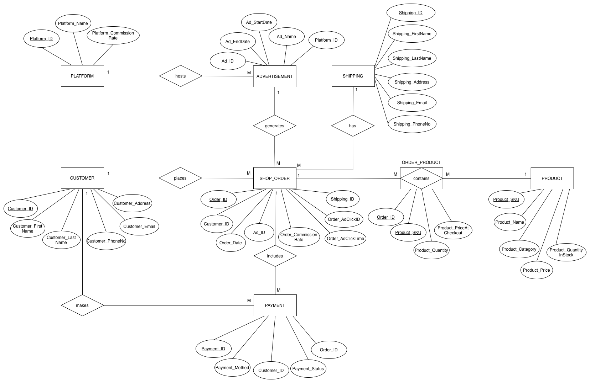

# David Jones EOFY Campaign: SQL Analytics & Database Design

A relational database and SQL analytics project modelling a David Jones **End of Financial Year (EOFY)** social media sales campaign. The project covers the full workflow from schema design through to business-facing analysis: an entity-relationship model, a normalised eight-table database, realistic sample data, and six SQL analyses that answer concrete marketing questions about platform performance, ad effectiveness, and customer behaviour.

> Built as an academic project for **BUSA8090 – Data and Visualisation for Business** (Master of Business Analytics, Macquarie University). All data is fictional.

---

## Business context

David Jones ran an EOFY sale promoted across five social media platforms (Facebook, Instagram, TikTok, X, and YouTube), each charging a different commission rate. The goal of this project is to design a database that captures the campaign's orders, advertisements, products, and payments, then use SQL to surface insights that would help the marketing team allocate budget more effectively.

The analysis answers six questions:

1. Which platform drives the highest gross sales?
2. Which platform is most cost-effective, measured by Return on Ad Spend (ROAS)?
3. Which individual ad campaigns generated the most revenue?
4. Which product categories sell best on each platform?
5. When (time of day) does each platform perform best?
6. What share of all orders is actually driven by advertising?

---

## Tech stack

- **MySQL** (DDL, DML, aggregate functions, joins, `CASE` logic, `HOUR()` date functions)
- Database design: ERD, normalisation, primary/foreign key constraints, an associative entity for a many-to-many relationship

---

## Repository structure

```
.
├── README.md
├── sql/
│   ├── schema.sql              # CREATE TABLE statements + constraints
│   ├── data.sql                # INSERT statements (sample data)
│   └── analysis_queries.sql    # The six business-concern queries
├── docs/
│   ├── report.pdf              # Full written report with insights
│   └── erd.png                 # Entity-relationship diagram
```

> The original assignment ships as a single combined `.sql` file. Splitting it into `schema`, `data`, and `analysis_queries` (as above) makes the repo easier to navigate, but a single file works fine too.

---

## Database design

The schema contains eight tables. `ORDER_PRODUCT` is an associative entity that resolves the many-to-many relationship between orders and products, and stores sale-specific detail (quantity and price at checkout).

| Table | Purpose |
|---|---|
| `PLATFORM` | Social media platforms and their commission rates |
| `ADVERTISEMENT` | Campaign ads, each hosted on one platform |
| `CUSTOMER` | Customers who place orders |
| `SHOP_ORDER` | Orders, including ad attribution and click timing |
| `SHIPPING` | Delivery details per order |
| `PRODUCT` | Products with category, price, and stock |
| `ORDER_PRODUCT` | Line items linking orders to products (associative) |
| `PAYMENT` | Payment method and status per order |



Key relationships include `PLATFORM` 1:M `ADVERTISEMENT`, `ADVERTISEMENT` 1:M `SHOP_ORDER` (optional, since some orders are organic), `CUSTOMER` 1:M `SHOP_ORDER`, and `SHOP_ORDER` M:M `PRODUCT` via `ORDER_PRODUCT`.

---

## Analysis & findings

### 1. Platform revenue performance
*Which platform drives the highest gross sales?* Joins `PLATFORM → ADVERTISEMENT → SHOP_ORDER → ORDER_PRODUCT` and sums quantity × checkout price.

| Platform | Total revenue |
|---|---|
| YouTube | $1,216.89 |
| Facebook | $1,106.80 |
| TikTok | $1,073.99 |
| Instagram | $794.99 |
| X | $596.00 |

YouTube leads on gross sales, with Facebook and TikTok close behind in a middle tier. These are gross figures only, so they do not yet account for the commission cost of generating them, which motivates the next analysis.

### 2. Return on Ad Spend (ROAS)
*Which platform is most cost-effective?* ROAS = total revenue ÷ total commission cost.

| Platform | Total revenue | Total cost | ROAS |
|---|---|---|---|
| X | $596.00 | $26.82 | 22.22 |
| Facebook | $1,106.80 | $57.44 | 19.27 |
| Instagram | $794.99 | $43.72 | 18.18 |
| TikTok | $1,073.99 | $64.44 | 16.67 |
| YouTube | $1,216.89 | $76.40 | 15.93 |

An inverse relationship emerges: the highest-revenue platforms (YouTube, TikTok) are the least efficient, while X returns the most per dollar of commission. Facebook stands out as the best all-rounder, combining strong volume with healthy efficiency.

### 3. Top-performing ad campaigns
*Which individual ads generated the most revenue?* (`ORDER BY ... DESC LIMIT 3`)

| Ad | Revenue |
|---|---|
| David Jones EOFY Final Days TikTok Ad | $746.00 |
| David Jones YouTube Technology Deals | $578.99 |
| David Jones Homewares EOFY Facebook Ad | $529.00 |

The top creative is a TikTok ad using urgent "Final Days" messaging, suggesting time-sensitive copy drives fast conversions on short-form platforms.

### 4. Category popularity by platform
*Which categories sell best on each platform?* Adds a join to `PRODUCT` and groups by platform and category.

| Platform | Category | Units sold |
|---|---|---|
| Facebook | Women Fashion | 4 |
| TikTok | Men Fashion | 3 |
| X | Kitchen | 3 |
| Facebook | Accessories | 2 |
| TikTok | Beauty | 2 |
| Instagram | Beauty | 2 |
| Instagram | Home | 2 |
| YouTube | Technology | 2 |
| YouTube | Kids | 2 |
| Facebook | Electrical | 1 |
| TikTok | Footwear | 1 |
| TikTok | Kitchen | 1 |
| Instagram | Accessories | 1 |
| Instagram | Toys | 1 |
| X | Accessories | 1 |
| YouTube | Fragrance | 1 |
| YouTube | Footwear | 1 |

Facebook leads in Women's Fashion (4 units), TikTok in Men's Fashion (3 units), and X in Kitchen (3 units), pointing to a clear product-to-platform fit that targeted campaigns could exploit.

### 5. Platform performance by time window
*When does each platform perform best?* Uses a `CASE` statement on `HOUR(Order_Date)` to bucket orders into late night, morning, afternoon, and evening, with `COUNT(DISTINCT Order_ID)` to avoid double-counting multi-item orders.

| Time window | Platform | Orders | Gross revenue |
|---|---|---|---|
| 1. Late Night (00-06) | TikTok | 1 | $249.00 |
| 1. Late Night (00-06) | YouTube | 1 | $179.99 |
| 2. Morning (06-12) | Facebook | 3 | $896.95 |
| 3. Afternoon (12-18) | Instagram | 4 | $794.99 |
| 3. Afternoon (12-18) | X | 3 | $596.00 |
| 3. Afternoon (12-18) | YouTube | 1 | $399.00 |
| 4. Evening (18-00) | TikTok | 3 | $824.99 |
| 4. Evening (18-00) | YouTube | 3 | $637.90 |
| 4. Evening (18-00) | Facebook | 1 | $209.85 |

Facebook dominates mornings, Instagram and X peak in the afternoon, and TikTok and YouTube drive the evening (together over $1,460 gross). This supports a dayparting strategy for ad scheduling.

### 6. Ad-driven order rate
*How much of the campaign's sales is ad-attributable?* A `LEFT JOIN` keeps all orders, including organic ones, so ad-driven orders can be compared against the total.

| Total orders | Ad-driven orders | Ad-driven rate |
|---|---|---|
| 29 | 20 | 68.97% |

Roughly seven in ten orders are linked to a paid ad, confirming social advertising as the dominant sales driver while flagging a ~31% organic segment worth understanding.

---

## Key recommendations

- Position **Facebook** as the primary conversion channel given its balance of volume and cost efficiency.
- Scale **X** cautiously to capitalise on its high ROAS, and test whether that efficiency holds at larger volume.
- Manage cost on **YouTube and TikTok**, where high revenue comes with the lowest ROAS, through tighter targeting or higher-margin products.
- Apply **dayparting**: Women's Fashion on Facebook in the morning, Kitchen and Beauty on X and Instagram in the afternoon, Technology and Men's Fashion on YouTube and TikTok in the evening.
- Reduce long-term reliance on paid media by investing in organic channels (SEO, email, loyalty).

---

## How to run

```sql
-- 1. Create the schema and tables
SOURCE sql/schema.sql;

-- 2. Load the sample data
SOURCE sql/data.sql;

-- 3. Run the analyses
SOURCE sql/analysis_queries.sql;
```

> The time-window query uses MySQL's `HOUR()` function. On other engines (e.g. PostgreSQL) substitute `EXTRACT(HOUR FROM Order_Date)`.

---

## Skills demonstrated

- Relational data modelling (ERD, normalisation, key constraints, associative entities)
- SQL: multi-table joins, aggregation, `GROUP BY`, `CASE` logic, date functions, `LEFT JOIN` for inclusive counts
- Translating raw query output into business recommendations

---

## Author

**Huynh Thien Luan Dang**
Master of Business Analytics, Macquarie University
